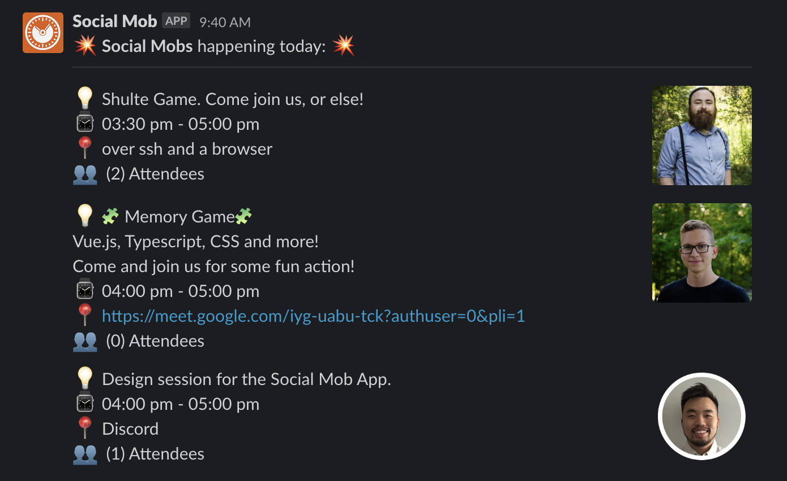

## Growth Sessions Slack Bot 🤖

Custom Slack application to post daily growth sessions.

Using [Netlify Functions](https://docs.netlify.com/functions/overview/) it will grab todays sessions and post them to Slack using webhook and their [Block Kit](https://api.slack.com/block-kit) component structure.

```ts
{
  type: 'section',
  block_id: `${session.id}`,
  text: {
    type: 'mrkdwn',
    text: `:bulb: ${session.title} \n :watch: ${session.start_time} - ${session.end_time} \n :round_pushpin: ${session.location} \n :busts_in_silhouette:  (${session.attendees.length}) Attendees`
  },
  accessory: {
    type: 'image',
    image_url: session.owner.avatar,
    alt_text: session.owner.name
  }
}
```

## Preview

<div align="center">
  
</div>
